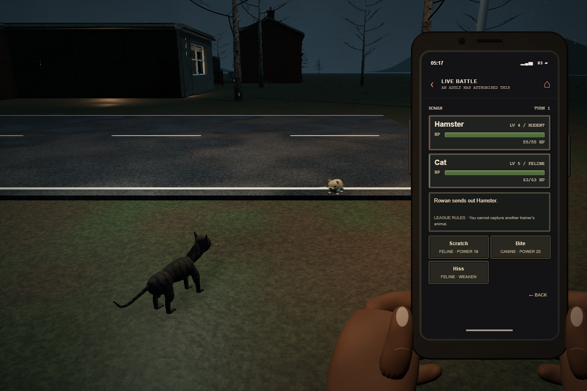

# Ordinary Animals

A dark first-person animal-battling parody. You are ten years old. A man in a white coat has decided that sending children out to capture ordinary animals counts as education.

**[Play the development build](https://samg-coder.github.io/ordinary-animals/)** · Desktop recommended · Three.js + Blender · MIT © 2026 SamGCoder



Captured from the running development build. [View the furnished kitchen](docs/screenshots/home-kitchen.png).

## The game

Start a **New Game**, name yourself and your rival, or **Load Game** from a browser save. **Settings** is available before entering the world. The opening begins in your bedroom with an SMS from Mum: it is your tenth birthday, she is at work, and Gary is expecting you.

Take your school bag, explore the furnished house, and leave through its front door. The house includes a kitchen, living room, parent's room, bathroom and utility room. Gary waits **inside** the walkable research clinic. Choose a cat, dog or hamster, then approach its pen and take the actual animal with you. It becomes your following companion. Your rival is outside for the first battle.

Mum's old phone contains Messages, Bag, Maps, Animals, the species Register, the League Guide and Settings. All four opening SMS messages are saved when they arrive, so leaving the introduction through Home preserves the conversation and starter progression. Later replies remain in Mum's chat. A separate Blender hand-and-device model frames the interface; its battle app uses boxed health meters, labelled HP bars and readable move details while animated animals fight in the 3D world in front of you.

Combat is turn based, with moves, levelling, type advantages, status effects, switching, healing and capture. Weaken conscious wild animals before throwing a carrier. A party holds six animals; further captures go to clinic storage. All eight species have wild encounter sites. Companions follow your walked route, while wild animals wander nearby.

Adult trainer loadouts retain their class attacks through levels 18–27 instead of forgetting them for unused support moves. This changes some late matchups; [the damage comparison](docs/progression-observations.md) records the effect and the remaining campaign-balance limits.

Bag lets you select an injured animal for treatment between encounters. Each medkit restores up to 60% of maximum HP; it cannot revive a fainted animal or clear a status effect. Full-health treatment spends nothing. Battle health panels retain attack/defence modifiers, which reset when an animal switches out or the encounter ends.

Mercy General Stores has a walkable interior and an unattended supply counter. Collect carriers and medkits there at lower prices than phone delivery. Home and the clinic provide free recovery. Maps unlocks travel to earned district destinations, and home/clinic bus travel after the first badge. Defeat returns you home with a treated party. Eight badges lead to a four-round county championship and an ending.

## The county

The 1.2 × 1.2 km region has eight distinct district environments assembled from reusable Blender assets:

| District     | Leader                 | Environment                                            |
| ------------ | ---------------------- | ------------------------------------------------------ |
| Wickmere     | The Crossing Guard     | School road, bus shelter, crossing and county school   |
| Ash End      | The Landlord           | Lettings office, tenements and a housing courtyard     |
| Briarfield   | The Groundskeeper      | Lodge, glasshouse and horticultural grounds            |
| North Drain  | The Sanitation Officer | Pump station, brick drainage channels and footbridge   |
| Blackwood    | The Ranger             | Forest edge, ranger lodge, timber gate and culvert     |
| Morrow Quay  | The Harbourmaster      | Harbour office, quay, water basin, pier and boat       |
| St. Marrow   | The Headteacher        | School block, gates, sports courts and bicycle shelter |
| Hollow Crown | The League Inspector   | Inspection office, barriers and surveillance           |

Connecting roads use modular surfaces, subtle paint, asphalt repairs, shallow scars and manholes. Residential lanes connect house rows and doorsteps. Separate utility poles and sagging cable spans follow the roads. Hills, embankments, natural pine variants, oaks, birches with revised bark and verge plants shape the countryside. Terrain heights come from the Blender meshes; roads and building foundations retain level ground. Institutional notices carry the joke through the bleak, rainy setting.

## Controls

| Action             | Control                                    |
| ------------------ | ------------------------------------------ |
| Walk / sprint      | WASD / Shift                               |
| Look               | Mouse look; drag or arrow keys as fallback |
| Release mouse look | Escape                                     |
| Interact           | E                                          |
| Torch              | F                                          |
| Open phone apps    | 3 or J while exploring                     |
| Battle moves       | 1–4 during your turn                       |
| Switch phone apps  | Phone Home and Back buttons                |

On touch screens, drag the lower-left joystick to walk and drag the right side of the world to rotate the camera. Hold **SPRINT** while moving to run; tap **TORCH** to toggle the light. Face a target and tap **INTERACT**, or tap **PHONE** to use the apps. Touch movement controls hide while the phone is open. The controls account for portrait/landscape layouts and screen safe areas; physical mobile hardware testing is still pending.

Brightness, graphics quality, sensitivity and camera movement preferences save separately from the campaign.

## Run locally

With Node 22 or newer:

```sh
npm ci
npm run dev -- --port 5174
```

Open `http://127.0.0.1:5174`. Campaign progress and messages are stored in that browser. GitHub Actions tests and builds `main`, then deploys `dist/` to GitHub Pages.

## Blender asset pipeline

The current catalog contains **167 individual GLB assets**, alongside a Blender-rendered HDR sky and a Blender-authored interface paper texture. World models, material images and character animations originate in editable Blender sources. Three.js places, batches, lights and plays those exports; it does not construct scenery from runtime primitives.

- `assets/`: separate `.blend` sources with packed images. Edit a road, tree, room fixture, building or character independently.
- `game-assets/asset-catalog.json`: source/export mapping, collision dimensions and terrain metadata. `bedroom-layout.json` positions the separate bedroom furnishings.
- `game-assets/texture-hashes.json`: generated hashes of exported image payloads. The loader verifies these before sharing identical Three.js texture sources; different texture settings remain separate. Nearby textures are uploaded incrementally before play. This does not remove the original downloads or image decoding work.
- `scripts/author_*.py` and focused Blender passes: individual assets or small kits. `scripts/reexport_asset.py` exports an edited source and refreshes its terrain samples where applicable.
- `src/world.js`, district modules, `home-clinic.js`, `corner-shop.js`, `residential-streets.js` and `utility-lines.js`: world assembly. `src/terrain.js` samples the exported ground triangles.
- `src/main.js`, `rules.js`, `animal-motion.js` and phone modules: exploration, combat, progression, animation playback, messages and saves.

Blender 5.2 is used for the source files. With Blender on your PATH, re-export one edited asset, then regenerate the image hashes before testing or building:

```sh
blender -b --python-exit-code 1 --python scripts/reexport_asset.py -- desk
node -e "require('node:fs').mkdirSync('artifacts', { recursive: true })"
node scripts/audit-asset-textures.mjs --write
```

Repeat hash generation after any GLB re-export or catalog change, and include the refreshed manifest with the exports. The production build copies catalog-listed models, the layout/lighting/hash manifests and the lighting manifest's sky. Working renders and audit scratch files stay in ignored `artifacts/`. Dependency licences are listed in [THIRD_PARTY_NOTICES.md](THIRD_PARTY_NOTICES.md).

## Verification and development status

This is an active development build. The latest completed checks are **165 passing unit/geometry tests**, a **successful 167-asset Blender source audit**, **59 passing no-input integration assertions**, and a **successful production build**. The image-hash manifest has been regenerated for the final exports. The integration run includes a finite-supply rival victory, a real Bag treatment for one medkit, save/load, phone navigation, visible battle modifiers, and rejected actions during pending or completed battles. Earlier county views remain documented in [the rebuild verification record](docs/rebuild-verification.md).

The latest update adds the **3** phone shortcut, field treatment, battle-state safeguards and shader preparation for the actual render passes. The cat has revised Blender anatomy and packed tabby materials; all eight exported Faint animations have sampled floor-contact checks. A small pale patch remains on the cat's upper foreleg, and the animals remain stylized. The final hamster, rat and rabbit whisker-fold corrections passed source/export contact tests but were not visually re-rendered before this release.

**Walked traversal, a fresh campaign from beginning to ending, and physical mobile hardware have not been validated for this rebuilt version.** The browser checks use explicit position/save fixtures and direct business functions with input capture suppressed. They verify selected logic and views, without establishing that every route, interaction or camera angle is polished.

The shader correction removed the observed hall and kitchen arrival Long Tasks in a focused repeat capture; their baseline Long Tasks were **591 ms and 275 ms**. A **55.6 ms hall frame interval remained**, and an earlier **599.9 ms utility-room interval** remains unexplained. See [shader preparation verification](docs/shader-preparation-verification.md) for the measurements and scope. These headless workstation results do not establish hitch-free play or mobile performance.

Automated coverage includes combat and progression rules, saves and messages, animal movement, source/export mappings, roads and housing, leader battle clearances, home/clinic/shop access, residential paths, terrain grounding and road-detail heights.

```sh
npm test
npm run build
blender -b --python-exit-code 1 --python scripts/audit_sources.py
```

The Blender audit checks editable geometry, packed images and terrain metadata, writes `docs/asset-audit.json`, and prints `SOURCE_AUDIT_PASSED` on success.

The optional browser integration harness remains dormant unless explicitly enabled. With the development server on port 5174 and Microsoft Edge installed:

```sh
node scripts/no-input-integration.mjs --run
```

It opens an isolated headless browser and invokes game functions through a temporary test bridge, without mouse, keyboard or pointer-lock input. The completed 59-assertion run includes the opening SMS/bag/starter sequence, a finite-supply rival victory, purchases, treatment, phone navigation and save/load. Direct target callbacks bypass line-of-sight interaction selection. Reports and screenshots go to `artifacts/`, including `no-input-integration.json`. Running without `--run` starts no browser.

The separate `scripts/no-input-world-review.mjs --run` harness captures named semantic views with two seconds to settle and three seconds of frame observations per view. Freeze runtime source files during a capture; navigation or hot reload invalidates that run. Results are local diagnostics, not a campaign completion claim.

Mobile controls use a left analogue joystick and an independent right-side look gesture, with hold-to-sprint and torch buttons. Controls reset on menus, cancellation, focus loss and viewport changes. `node scripts/no-input-mobile-controls.mjs --run` verified visible, reachable controls at 390×844 and 844×390, actual frame-loop movement from direct controller state, and movement cancellation when opening the phone. Unit checks cover simultaneous movement/look pointer ownership, release order, deadzone and diagonal speed limits. These checks use no browser input events and do not replace physical iOS/Android testing.

## License

Original code, Blender assets, textures and authored animations are released under the [MIT license](LICENSE), credited to **SamGCoder**. This is an independent parody with original characters, locations, writing and assets.
