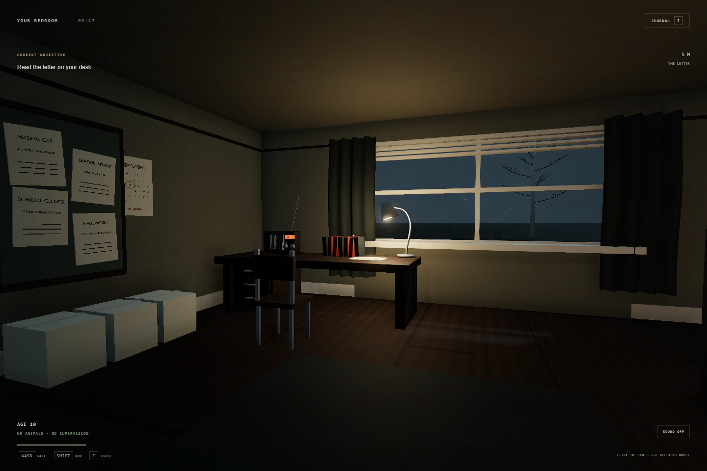

# Ordinary Animals

A dark first-person animal-battling parody. You are ten years old. A man with a white coat has decided that sending children out to collect and battle ordinary animals counts as education.

**[Play the development build](https://samg-coder.github.io/ordinary-animals/)** · Desktop recommended · MIT © 2026 SamGCoder



## The game

Wake up in your bedroom in Wickmere. Read your mother's letter, leave through the hallway, and meet Gary at the county research office. Choose a cat, dog, or hamster, battle your neighbour, capture wild animals, and challenge eight district leaders before the four-round county championship.

Exploration and battles use the child's first-person viewpoint. The tone comes from rain, cold dawn light, empty streets, institutional notices, and the absurd confidence of adults who should know better. Battles use a boxed Fight / Bag / Animals / Run menu with arrow-key selection. Dialogue types onto the page and can be revealed immediately with Next. The journal is presented as a county field notebook. Combat is turn based: four moves per species, HP, speed, type advantages, status effects, healing, switching, fainting, and capture odds based on the wild animal's remaining HP. A party holds six animals. Further captures go to clinic storage (120 spaces), so collecting can continue with a full party. The field journal records seen and registered species, and all eight species have wild encounter sites. Transfer animals at home or near Gary’s clinic; at least one conscious companion must stay with you.

Wild animals wander between nearby clear points, pause when approached, and use the Blender idle and walk clips. Companions follow the player’s walked route through doors and around walls. A wild encounter hides its roaming duplicate, and a captured or defeated animal site rests for 90 seconds before returning.

Campaign progress saves in this browser. Defeat returns you to your room with a healed party. Your bedroom and Gary offer free recovery. Earned district offices unlock travel through the journal map.

## Current status

This is an actively developed playable build, not a finished photorealistic release. The bedroom and first route have received the most detailed art passes. Old School Road has textured soil, animated grass verges, loose gravel, weathered stone boundaries, animated oaks, brambles, bus shelter, crossing and a separate county school asset and an animated crossing guard. The 1.2 km square region has roads, encounter sites, eight district destinations, and a complete campaign progression system; its distant districts still reuse architecture and need more individual environments. Human faces, animal deformation, terrain variety, and interactions inside additional buildings remain art and design priorities.

Verified in the browser:

- A fresh save: bedroom → letter → both doors → clinic → starter → rival victory.
- Save-fixture regression scenarios: weakened wild capture, full-party capture into storage, clinic-only transfers, persistent species records, inventory consumption, party persistence across reload, defeat and recovery, and the final multi-animal championship round through the ending and return home.
- All eight animal exports: idle, walk, attack, hit, and faint clips, with skeletal skins and visual contact sheets.

The ending scenario uses a late-game save fixture. It is not a claim that the entire campaign has been manually played from a fresh save.

## Controls

| Action | Control |
| --- | --- |
| Walk / sprint | WASD / Shift |
| Look | Mouse; click the world to lock the pointer |
| Release pointer | Escape |
| Look fallback | Drag or arrow keys |
| Interact | E |
| Torch | F |
| Journal, map, party, settings | J |

Graphics, brightness, sensitivity, and camera movement are adjustable and saved separately from campaign progress. Mobile has touch controls and defaults to the performance setting; the intended experience is on desktop.

## Blender asset pipeline

The active build contains **81 individual GLB assets plus a Blender-rendered HDR sky and a Blender-authored interface paper texture**. Every active world mesh, material image, and character animation originates in a corresponding editable Blender source. No downloaded scenery, stock animals, or runtime primitive scenery is used.

- `assets/`: separate `.blend` sources with packed images. Open a single tree, chair, door, animal, road segment, or building and edit it directly.
- `game-assets/asset-catalog.json`: the source/export mapping and local collision dimensions.
- `game-assets/bedroom-layout.json`: placement data for separate furnishings.
- `src/world.js`: placement and spatial batching of the exported modules. It does not generate world mesh primitives.
- `src/main.js`: first-person input, lighting, animation playback, encounters, battle presentation, UI, audio, and saves.
- `src/rules.js`: combat, progression definitions, and save validation.
- `assets/field-paper.blend`: editable stationery material; `scripts/author_interface_paper.py` exports the packed texture used by the game interface.

To export **one edited asset** with Blender on your PATH:

```sh
blender -b --python scripts/reexport_asset.py -- desk
```

The source authoring scripts support independent passes. For example, to rebuild only the cat:

```sh
blender -b --python scripts/author_animals.py -- cat
blender -b --python scripts/refine_animals.py -- cat
blender -b --python scripts/coat_materials.py -- cat
```

`author_blender.py` and `modular_assets.py` are the initial library factories. `detail_assets.py`, `refine_people.py`, and `author_sky.py` are subsequent Blender art passes. `pack_sources.py` packs used images and compresses the editable sources. A normal art edit only requires re-exporting its own file; the world is assembled from those reusable pieces.

The production build copies only catalog-listed assets and the sky manifest. Historical files under `public/`, working texture folders, and the unused monolithic bedroom export are not served or shipped.

## Run and verify

Node 22 or newer:

```sh
npm ci
npm run dev -- --port 5174
```

In a second terminal:

```sh
npm test
node scripts/opening-playtest.mjs --route-one
node scripts/campaign-scenarios.mjs
node scripts/animal-visual-check.mjs
node scripts/interface-check.mjs
node scripts/battle-interface-check.mjs
node scripts/animal-motion-check.mjs
node scripts/opening-playtest.mjs --animal-motion
npm run build
```

The browser scripts use Playwright with the locally installed Microsoft Edge channel and write screenshots to ignored `artifacts/`. Their input helpers use ordinary pointer and keyboard events; the game's development inspection API is read-only and is removed from production builds.

GitHub Actions tests and builds `main`, then deploys `dist/` to GitHub Pages. The game uses Three.js and Vite. See [THIRD_PARTY_NOTICES.md](THIRD_PARTY_NOTICES.md).

## License

Original code, Blender assets, textures, and authored animations are released under the [MIT license](LICENSE), credited to **SamGCoder**. This is an independent parody with original characters, locations, writing, and assets.
