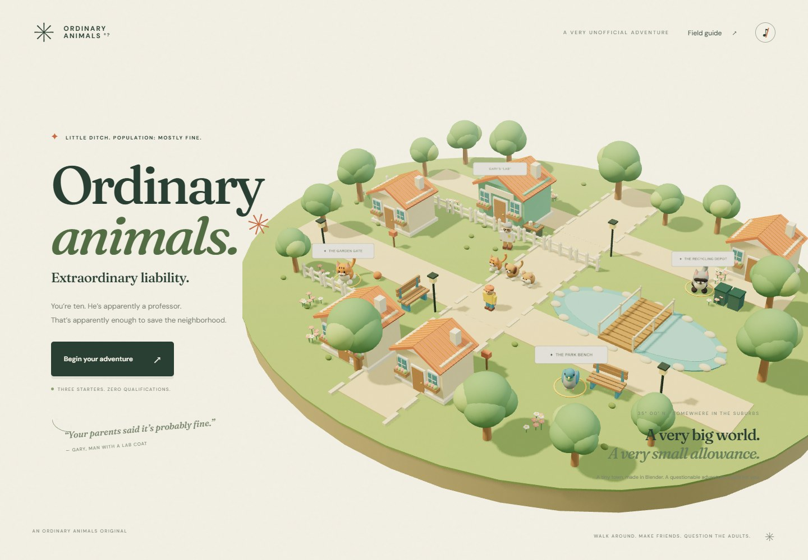
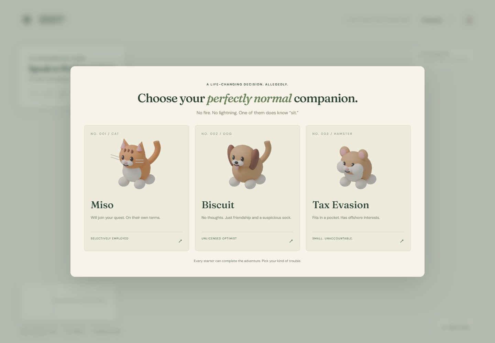

# Ordinary Animals

### Extraordinary liability.

**You’re ten. He’s apparently a professor. That’s apparently enough to save the neighborhood.**

[Play in your browser](https://SamG-Coder.github.io/ordinary-animals/) · [MIT license](LICENSE) · [Blender asset source](assets/ordinary-animals.blend)



A complete, compact single-player animal adventure built with **Three.js**, with original models and animation authored in **Blender**. Choose an ordinary cat, dog, or hamster. Explore three regions, make ten friends, and become an Ordinary Animal Master under the extremely unofficial supervision of Professor Gary.

Gary’s laboratory is a garage. His doctorate is a mindset. Your hamster may have offshore interests.

## The adventure

- **Choose your colleague:** Miso the cat, Biscuit the dog, or Tax Evasion the hamster. Every starter can finish the campaign.
- **Three chapters:** Little Ditch, Mildly Inconvenient Woods, and Almost-on-Sea.
- **Nine regional encounters:** a pigeon, cat, raccoon, rabbit, fox, tortoise, duck, sheep, and goat.
- **A final championship:** Gary’s hamster, Municipal Bond, finally competes in something.
- **A proper ending:** earn your certificate, see the credits, and keep exploring the unlocked regions.
- **A persistent journal:** earned stamps, starter, chapter, and completion save locally on your device. The field guide allows travel to unlocked regions.
- **Gentle turn-based encounters:** read the animal’s mood and build trust with reassurance, snacks, and play. Failed encounters can be retried with full confidence. No animal harm.
- **A miniature 3D world:** warm lighting, soft shadows, animated animals, a following companion, ground navigation around obstacles, and optional synthesized music and sound effects.
- **Desktop and touch controls**, responsive menus, keyboard focus handling, and reduced-motion support.



## Controls

| Action | Control |
| --- | --- |
| Walk | WASD or arrow keys |
| Walk to a place | Click or tap clear ground |
| Talk / meet an animal | E, or the interaction button |
| Mobile movement | On-screen direction pad |
| Journal and region travel | Field guide |
| Close guide / leave encounter | Escape |
| Return near Gary | House button |
| Music and sound | Note button in the top right |

After earning three stamps in a region, talk to Gary to continue. After all nine regional stamps, he introduces the final challenge. Snacks are unlimited; their supply is the one thing Gary planned competently.

This is a short, complete campaign, rather than a large open-world RPG. The starter personalities are cosmetic; the encounter rules are shared. Saving is local to your browser, not a cloud account. A current browser with WebGL and hardware acceleration is required. Google Fonts are optional; local serif and sans-serif fallbacks are provided.

## Run locally

Requires Node.js 22.12+ (Node.js 24 is also supported).

```sh
npm ci
npm run dev
```

Open the local URL printed by Vite. To build the GitHub Pages version:

```sh
npm test
npm run build
npm run preview
```

The Vite base is relative, so the build works under a GitHub Pages repository path. The repository’s GitHub Actions workflow tests and builds each push to `main`, then deploys `dist` using GitHub Pages.

## Blender assets

`assets/ordinary-animals.blend` contains the editable asset library, arranged in a labeled grid of collections. There are **19 exported GLB assets** and **11 rendered animal portraits**. The `.blend`, generated models, portrait renders, scripts, and original game code are covered by the project’s MIT license.

The asset pipeline is reproducible. From the repository root, using Blender 5.2 or a compatible version:

```sh
blender --background --factory-startup --python scripts/build_assets.py
blender --background --python scripts/render_portraits.py
```

The first script models the animals, people, buildings, trees, fences, bench, and flowers, creates idle animation, exports GLBs, and saves the source `.blend`. The second renders transparent portraits using Cycles. No downloaded character assets or proprietary game assets are used.

Models load through Three.js GLTFLoader and their Blender animation plays through AnimationMixer. Runtime movement adds a simple walking bounce. Static scene meshes are batched by material to reduce draw calls. Town placement, terrain, paths, bridge, pond, and some simple props are assembled in Three.js.

## Validation

```sh
npm test
```

The unit suite covers every encounter’s victory path, failure and retry, final challenge balance, save validation, chapter locks, and obstacle navigation.

For browser checks, first run the local dev server on port 5173, then:

```sh
node scripts/browser-check.mjs
node scripts/campaign-check.mjs
node scripts/mobile-check.mjs
node scripts/retry-check.mjs
```

On Windows these use installed Microsoft Edge through Playwright. Elsewhere run `npx playwright install chromium` first. The campaign check starts with a new save and walks through all three chapters using actual UI input, wins all encounters, reloads to check persistence, reaches the certificate, and revisits an unlocked region. A development-only read-only helper projects world coordinates for the browser tests; production builds do not expose it.

## Project map

| Path | Purpose |
| --- | --- |
| `src/game.js` | Campaign, animal personalities, encounters, save validation |
| `src/main.js` | Three.js world, input, UI, audio, progression |
| `src/navigation.js` | Grid pathfinding around obstacles |
| `src/style.css` | Responsive game interface |
| `scripts/build_assets.py` | Blender modeling and GLB export |
| `scripts/render_portraits.py` | Blender portrait rendering |
| `assets/ordinary-animals.blend` | Editable original asset library |
| `public/models` | Game-ready GLB exports |
| `public/portraits` | Rendered animal portraits |
| `.github/workflows/pages.yml` | Automated public build and deployment |

## Credits and license

**Copyright © 2026 SamGCoder. MIT licensed.**

Original game, characters, writing, models, and asset pipeline. Third-party libraries retain their own licenses; see [third-party notices](THIRD_PARTY_NOTICES.md).

An independent, original animal-adventure parody. Not affiliated with Pokémon, Nintendo, Game Freak, or an actual educational institution.
